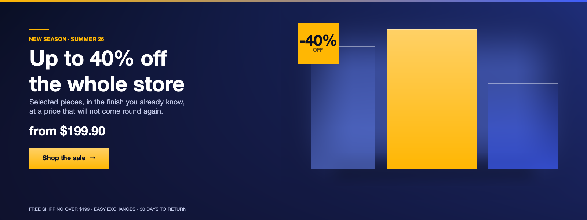
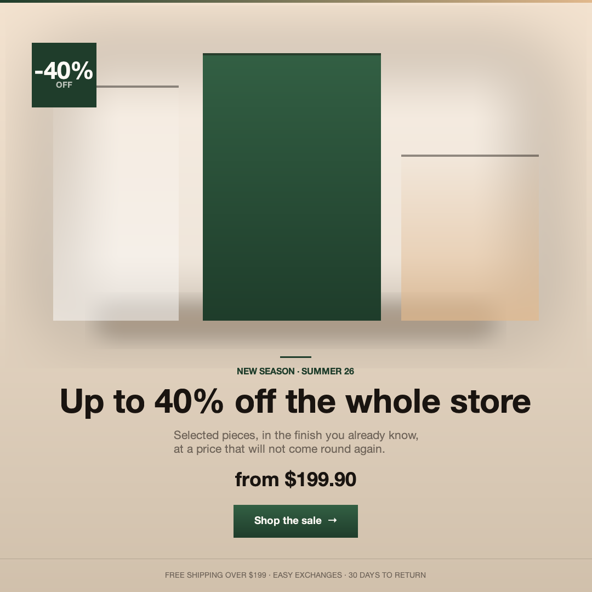

# Examples

## `ecommerce_banner.rb`

A storefront banner composed entirely with the Loomy DSL: gradients for light,
groups for soft edges, text wrapped by `width:` at a width chosen to balance its
lines, and measured type for the button and the headline's size.

```bash
bundle exec ruby examples/ecommerce_banner.rb
bundle exec ruby examples/ecommerce_banner.rb --theme ivory --preset square
bundle exec ruby examples/ecommerce_banner.rb --product shoe.png --out hero.jpg
bundle exec ruby examples/ecommerce_banner.rb --all --out banners
```

Four canvases (`hero`, `wide`, `square`, `story`), four palettes (`midnight`,
`orchid`, `verdant`, `ivory`), and every line of copy behind a flag —
`--help` lists them. Passing an empty string to one drops that block and the
column closes up. With no `--product`, the artwork is a composition of gradient
panels; with one, it is trimmed to its content and the shadow and discount badge
follow its real outline.

The two images below are checked in as-is, straight from the two commands under
each of them.

```bash
bundle exec ruby examples/ecommerce_banner.rb --theme midnight --preset hero --out examples/banner-midnight-hero.png
```



```bash
bundle exec ruby examples/ecommerce_banner.rb --theme ivory --preset square --out examples/banner-ivory-square.png
```



### What it works around

Two things it wants are not in Loomy yet, and the shapes of the workarounds
are worth knowing before you copy them:

- **No radial gradient, no masking, no rounded corners.** Light is a two-stop
  linear gradient whose far stop is the same colour at alpha 0, so it fades to
  nothing rather than to black.
- **`blur` only feathers where it has room to.** On a solid that fills its
  frame there is no transparent margin to bleed into and the rectangle stays
  hard-edged. Every glow and shadow here is therefore a solid sat inside a
  *larger* group, blurred so the fade happens in the group's margin.
