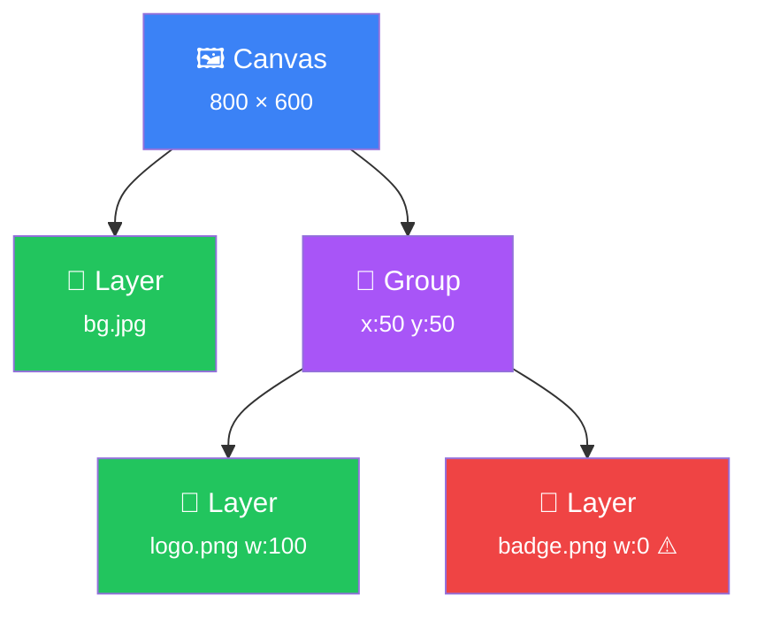
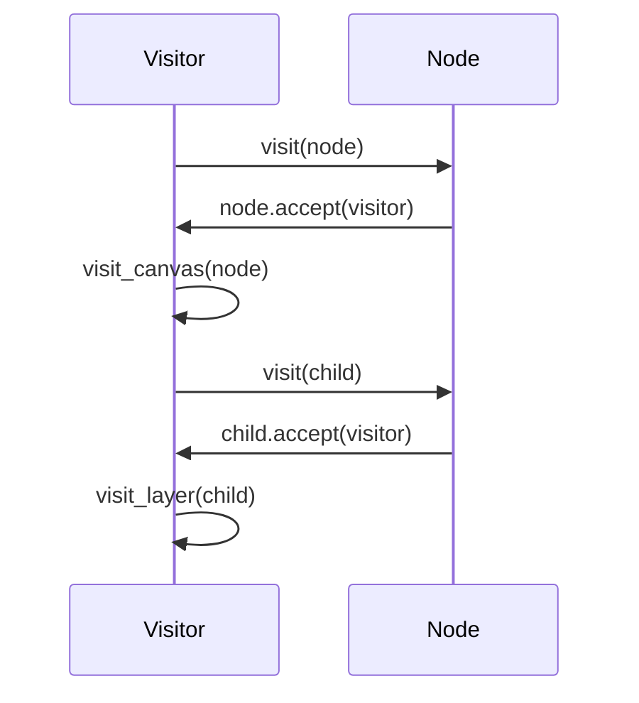
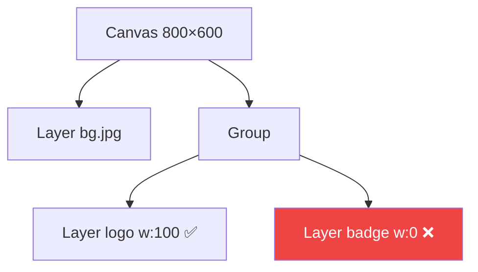
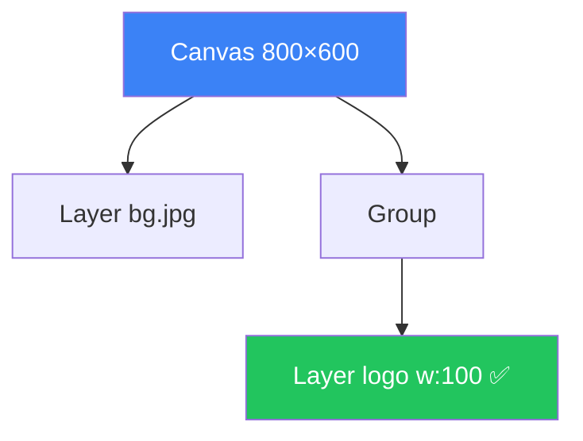

# Arquitetura de Compiladores <br/> no Dia a Dia

<div class="flex items-center gap-4 mt-8">
  
  <div>
    <p class="text-xl !m-0">Como AST, Visitor Pattern e Otimização resolveram<br/>minhas dores no <strong>Loomy</strong></p>
  </div>
</div>

<div class="abs-br m-6 flex gap-2 text-sm opacity-60">
  <span>João Alves</span>
</div>

---
layout: two-cols
layoutClass: gap-8
---

# O Problema 😤

<div class="text-sm">

O jeito "normal" de processar imagens:

```ruby {all|1|2|3|4|5|6|all}
# Imperativo: cada linha EXECUTA na hora
bg = Vips::Image.new_from_file("bg.jpg")      # Carrega
bg = bg.resize(2.0)                            # Processa
logo = Vips::Image.new_from_file("logo.png")   # Carrega
logo = logo.resize(0.5)                        # Processa
result = bg.composite(logo, :over)             # Compõe
```

</div>

<v-click>
<div class="mt-4 p-3 bg-red-500/10 border border-red-500/30 rounded text-sm">

⚠️ **Cada linha executa imediatamente.**

E se o `logo.png` tiver `width: 0`? Já gastamos CPU e memória carregando ele à toa.

</div>
</v-click>

::right::

<v-click>

# A Solução 🎯

<div class="text-sm">

O jeito **Loomy** — declarativo:

```ruby
# Declarativo: NADA executa ainda
Loomy.render("out.png", size: [800, 600]) do
  layer "bg.jpg"

  group x: 50, y: 50 do
    layer "logo.png", width: 100
  end
end
```

</div>

<div class="mt-4 p-3 bg-green-500/10 border border-green-500/30 rounded text-sm">

✅ **Separa a definição da execução.**

Primeiro monta a "receita", depois otimiza, aí sim executa.

</div>

</v-click>

---
layout: center
class: text-center
---

# A Analogia do Restaurante 🍽️

<p class="text-lg opacity-70">Como um restaurante nos ensina arquitetura de compiladores</p>

---

# O Restaurante 🍽️

<div class="grid grid-cols-4 gap-3 mt-4">

<div v-click class="p-3 bg-blue-500/10 rounded-lg text-center">
  <div class="text-3xl mb-1">🧑</div>
  <div class="font-bold text-blue-400 text-sm">O Cliente</div>
  <div class="text-xs mt-1 opacity-80">Faz o pedido de forma natural</div>
  <div class="mt-2 p-1.5 bg-blue-500/20 rounded text-xs font-mono">DSL</div>
  <div class="text-xs mt-1 opacity-60">"Quero um hambúrguer sem picles"</div>
</div>

<div v-click class="p-3 bg-yellow-500/10 rounded-lg text-center">
  <div class="text-3xl mb-1">📋</div>
  <div class="font-bold text-yellow-400 text-sm">A Comanda</div>
  <div class="text-xs mt-1 opacity-80">Pedido anotado e estruturado</div>
  <div class="mt-2 p-1.5 bg-yellow-500/20 rounded text-xs font-mono">AST</div>
  <div class="text-xs mt-1 opacity-60">É só papel — a comida ainda não existe</div>
</div>

<div v-click class="p-3 bg-purple-500/10 rounded-lg text-center">
  <div class="text-3xl mb-1">👨‍💼</div>
  <div class="font-bold text-purple-400 text-sm">O Gerente</div>
  <div class="text-xs mt-1 opacity-80">Revisa antes de mandar pra cozinha</div>
  <div class="mt-2 p-1.5 bg-purple-500/20 rounded text-xs font-mono">Otimizador</div>
  <div class="text-xs mt-1 opacity-60">"Com picles" + "Sem picles" → risca o conflito</div>
</div>

<div v-click class="p-3 bg-red-500/10 rounded-lg text-center">
  <div class="text-3xl mb-1">👨‍🍳</div>
  <div class="font-bold text-red-400 text-sm">A Cozinha</div>
  <div class="text-xs mt-1 opacity-80">Só executa o necessário</div>
  <div class="mt-2 p-1.5 bg-red-500/20 rounded text-xs font-mono">libvips</div>
  <div class="text-xs mt-1 opacity-60">Custo real: CPU e memória</div>
</div>

</div>

<v-click>
<div class="mt-3 text-center text-sm opacity-70">

💡 A cozinha **nunca** precisa saber que o cliente mudou de ideia. O gerente já limpou a comanda.

</div>
</v-click>

---
layout: center
class: text-center
---

# Construindo a Árvore 🌳

<p class="text-lg opacity-70">AST — Abstract Syntax Tree</p>

---

# O que é uma AST?

<v-click>

**Uma representação em árvore da sua intenção.** Não é código. Não é execução. É uma **estrutura de dados** que descreve o que você quer fazer.

</v-click>

<v-click>
<div class="mt-3 grid grid-cols-3 gap-3 text-xs">

<div class="p-2 bg-slate-500/10 rounded">
  <div class="font-bold mb-1">🔄 Babel / SWC</div>
  Transforma código JS/TS usando AST para converter sintaxe moderna
</div>

<div class="p-2 bg-slate-500/10 rounded">
  <div class="font-bold mb-1">⚛️ React Virtual DOM</div>
  Árvore de componentes em memória — diff antes de tocar no DOM real
</div>

<div class="p-2 bg-slate-500/10 rounded">
  <div class="font-bold mb-1">🗃️ SQL Query Planner</div>
  `SELECT * FROM users` vira uma árvore de operações que o DB otimiza
</div>

</div>
</v-click>

<v-click>
<div class="mt-3 p-2 bg-green-500/10 border border-green-500/30 rounded text-sm">

🎯 **No Loomy:** o código Ruby que você escreve (`layer "foto.png"`) não chama o processador de imagem. Ele apenas cria nós em memória.

</div>
</v-click>

---

# DSL → AST no Loomy

<div class="grid grid-cols-2 gap-6">
<div>

### O que você escreve:

```ruby
Loomy.render("out.png", size: [800, 600]) do
  layer "bg.jpg"

  group x: 50, y: 50 do
    layer "logo.png", width: 100
    layer "badge.png", width: 0  # ← erro!
  end
end
```

</div>
<div>

### O que é criado em memória:



</div>
</div>

<v-click>
<div class="text-center text-sm mt-2 opacity-70">

Nenhuma imagem foi carregada. Nenhum pixel foi processado. **Só dados.**

</div>
</v-click>

---

# Os Nós da Árvore

<div class="grid grid-cols-2 gap-4 mt-2">
<div>

A classe base de todos os nós:

```ruby {all|2|3-6|8-10|all}
class Loomy::AST::Node
  attr_reader :children, :properties
  def initialize(properties = {})
    @properties = properties
    @children = []
  end
  def accept(visitor)
    visitor.visit(self)
  end
end
```

<v-click at="5">
<div class="mt-1 p-1.5 bg-yellow-500/10 rounded text-xs">

👆 `accept(visitor)` — o nó mostra o "crachá" dizendo quem ele é, e o visitor sabe qual método chamar.

</div>
</v-click>

</div>
<div>

<v-click at="6">

Os tipos de nó:

| Nó | Papel | Props principais |
|---|---|---|
| **Canvas** | Raiz (tela) | `size: [w, h]` |
| **Layer** | Conteúdo | `source, solid, text, width, height, effects` |
| **Group** | Container | `x, y, effects` |
| **Stack** | Layout auto | `direction, spacing` |
| **Effect** | Pós-processo | `radius, brightness...` |

</v-click>

</div>
</div>

---

# Metaprogramação: O Truque da DSL ✨

Como `layer "bg.jpg"` funciona dentro do bloco?

```ruby {all|3|4|all}
# PipelineBuilder — Simplificado
def build(&block)
  canvas = AST::Canvas.new(size: @options[:size])
  CanvasBuilder.new(canvas).instance_eval(&block)
  canvas
end
```

<v-click at="4">
<div class="grid grid-cols-2 gap-4 mt-2">
<div class="p-2 bg-red-500/10 rounded text-sm">

**Sem** `instance_eval`:
```ruby
builder = CanvasBuilder.new(canvas)
builder.layer("bg.jpg")     # Verboso
builder.group(x: 50) do ... # Feio
```

</div>
<div class="p-2 bg-green-500/10 rounded text-sm">

**Com** `instance_eval`:
```ruby
Loomy.render("out.png", size: [800,600]) do
  layer "bg.jpg"       # ✨ Limpo!
  group x: 50 do ... end
end
```

</div>
</div>

<div class="mt-2 text-sm text-center opacity-70">

`instance_eval` muda o `self` dentro do bloco → `layer` vira `self.layer` no `CanvasBuilder`

</div>
</v-click>

---
layout: center
class: text-center
---

# O Visitor Pattern 🚶

<p class="text-lg opacity-70">Como percorrer a árvore sem poluir os dados</p>

---

# O Problema: Como Percorrer?

Temos uma árvore (AST). Precisamos fazer **coisas diferentes** com ela:

<div class="grid grid-cols-3 gap-3 mt-3">

<div v-click class="p-2 bg-purple-500/10 rounded text-center text-sm">
  <div class="text-xl mb-1">🔍</div>
  <strong>Otimizar</strong><br/>
  <span class="text-xs">Remover nós inúteis, resolver dimensões</span>
</div>

<div v-click class="p-2 bg-blue-500/10 rounded text-center text-sm">
  <div class="text-xl mb-1">📋</div>
  <strong>Planejar</strong><br/>
  <span class="text-xs">Converter AST em operações executáveis</span>
</div>

<div v-click class="p-2 bg-green-500/10 rounded text-center text-sm">
  <div class="text-xl mb-1">🎨</div>
  <strong>Renderizar</strong><br/>
  <span class="text-xs">Executar operações com libvips</span>
</div>

</div>

<v-click>
<div class="mt-3 p-2 bg-red-500/10 border border-red-500/30 rounded text-sm">

❌ **Tentação 1:** colocar `optimize()`, `plan()`, `render()` dentro de cada nó. Resultado? Classes de dados poluídas com lógica que não é delas.

</div>
</v-click>

<v-click>
<div class="mt-2 p-2 bg-orange-500/10 border border-orange-500/30 rounded text-sm">

❌ **Tentação 2:** um `case` gigante — e a cada novo nó, mais um `when`:

```ruby
def optimize(node)
  case node
  when Canvas then ...
  when Layer then ...   # E se criar Stack? Mais um when.
  when Group then ...   # E no Planner? Outro case igualzinho.
  end
end
```

</div>
</v-click>

<v-click>
<div class="mt-2 p-2 bg-green-500/10 border border-green-500/30 rounded text-sm">

✅ **Solução:** Visitor Pattern — a lógica fica em classes separadas que "visitam" os nós.

</div>
</v-click>

---

# Visitor Pattern — Como Funciona

<div class="text-sm mb-2">

💡 A ideia: o Visitor pede pra visitar um nó. O nó responde **"eu sou um Layer!"** — e o Visitor já sabe qual método chamar. **Sem `if`, sem `case`.**

</div>

<div class="grid grid-cols-2 gap-4 mt-2">
<div>

### Double Dispatch

```ruby {all|2-3|5-7|9-11|all}
class Visitor
  def visit(node)
    node.accept(self)  # → passo 1
  end
  def visit_canvas(node)
    node.children.each { |c| visit(c) }
  end
  def visit_layer(node)
    # Lógica específica para Layer
  end
end
```

</div>
<div>

<v-click at="4">

### O "Aperto de Mão"



</v-click>

</div>
</div>

---

# Resumindo: O "Aperto de Mão" 🤝

<div class="flex justify-center mt-6">
<div class="flex items-center gap-4 text-center">

<div v-click class="p-4 bg-blue-500/10 rounded-lg">
  <div class="text-3xl mb-2">🚶</div>
  <div class="font-bold text-blue-400">Visitor</div>
  <div class="text-xs mt-1 opacity-80">"Posso te visitar?"</div>
</div>

<div v-click class="text-2xl">→</div>

<div v-click class="p-4 bg-green-500/10 rounded-lg">
  <div class="text-3xl mb-2">🏷️</div>
  <div class="font-bold text-green-400">Node</div>
  <div class="text-xs mt-1 opacity-80">"Claro! Eu sou um <strong>Layer</strong>."</div>
</div>

<div v-click class="text-2xl">→</div>

<div v-click class="p-4 bg-purple-500/10 rounded-lg">
  <div class="text-3xl mb-2">⚡</div>
  <div class="font-bold text-purple-400">Visitor</div>
  <div class="text-xs mt-1 opacity-80">"Pra Layer eu faço <strong>isso</strong>."</div>
</div>

</div>
</div>

<v-click>
<div class="mt-6 text-center text-sm opacity-70">

O nó **não sabe** o que o visitor vai fazer. O visitor **não precisa** de `if/case` para decidir o tipo. Cada um faz sua parte. 🎯

</div>
</v-click>

---

# O Otimizador em Ação 🔧

<div class="grid grid-cols-2 gap-4 mt-1">
<div>

<div class="text-xs opacity-70 mb-1">O <code>AST::Optimizer</code> é um Visitor que <strong>poda</strong> e <strong>resolve</strong> a árvore:</div>

```ruby {all|3-4|6-7|9-10|all}
class Optimizer < Visitor
  def visit_layer(node)
    node.properties[:width] =
      resolve_dim(node.width, parent_w)
    # Poda: dimensão zero? Fora!
    return nil if node.width == 0
    # Poda: efeitos inúteis
    node.effects.compact!
    node
  end
  def visit_blur_effect(node)
    node.radius <= 0 ? nil : node
  end
end
```

</div>
<div>

<v-click at="4">

### Antes (AST "suja"):



</v-click>

<v-click>

### Depois (AST "limpa"):



</v-click>

</div>
</div>

---

# Dois Visitors, Mesmo Padrão ♻️

O poder do Visitor: **mesma estrutura, comportamentos diferentes.**

<div class="grid grid-cols-2 gap-4 mt-3">

<div v-click class="p-3 bg-purple-500/10 rounded">

### 🔍 AST::Optimizer
```ruby
class Optimizer < Visitor
  def visit_layer(node)
    return nil if node.width == 0
    node
  end
end
```
<div class="text-sm">Percorre a AST → <strong>poda nós inúteis</strong></div>

</div>

<div v-click class="p-3 bg-blue-500/10 rounded">

### 📋 Planner::Builder
```ruby
class Builder < Visitor
  def visit_layer(node)
    Ops::Load.new(node.source)
      .then(Ops::Resize.new(node.width))
  end
end
```
<div class="text-sm">Percorre a AST → <strong>gera Ops executáveis</strong></div>

</div>

</div>

<v-click>
<div class="mt-3 text-sm text-center">

A AST **nunca muda** de forma. Quem muda é o **Visitor** que a percorre. Quer adicionar um novo comportamento? Crie um novo Visitor. Zero mudanças na AST. 🎯

</div>
</v-click>

---
layout: center
class: text-center
---

# O Pipeline Completo ⚡

<p class="text-lg opacity-70">Da intenção à imagem final</p>

---

# O Pipeline Completo

<div class="mt-4 flex flex-col items-center gap-0.5">

<div v-click class="flex items-center gap-3">
  <div class="px-3 py-1.5 bg-blue-500/20 rounded-lg font-mono text-sm">DSL</div>
  <div class="text-xs opacity-60">Código Ruby declarativo</div>
</div>

<div v-click class="text-sm leading-none">↓</div>

<div v-click class="flex items-center gap-3">
  <div class="px-3 py-1.5 bg-yellow-500/20 rounded-lg font-mono text-sm">AST</div>
  <div class="text-xs opacity-60">Árvore em memória (Canvas → Layers)</div>
</div>

<div v-click class="text-sm leading-none">↓</div>

<div v-click class="flex items-center gap-3">
  <div class="px-3 py-1.5 bg-purple-500/20 rounded-lg font-mono text-sm">Optimizer</div>
  <div class="text-xs opacity-60">Poda, resolve %, remove no-ops</div>
</div>

<div v-click class="text-sm leading-none">↓</div>

<div v-click class="flex items-center gap-3">
  <div class="px-3 py-1.5 bg-cyan-500/20 rounded-lg font-mono text-sm">Planner</div>
  <div class="text-xs opacity-60">AST → Ops (Load, Resize, Composite...)</div>
</div>

<div v-click class="text-sm leading-none">↓</div>

<div v-click class="flex items-center gap-3">
  <div class="px-3 py-1.5 bg-red-500/20 rounded-lg font-mono text-sm">libvips</div>
  <div class="text-xs opacity-60">Execução real — pixels processados</div>
</div>

</div>

<v-click>
<div class="mt-3 text-center text-sm opacity-70">

```ruby
# Tudo isso acontece em UMA linha:
image = Loomy.generate(size: [800, 600], &block)
#       DSL.build → AST::Optimizer.call → Engine::VipsBackend.call
```

</div>
</v-click>

---

# Lazy Evaluation — O Pulo do Gato

<div class="grid grid-cols-2 gap-4 mt-3">

<div>

### 🐌 Imperativo (Eager)

```ruby {all|1-2|3-4|5|all}
# TUDO executa na hora
bg = load("bg.jpg")         # Carrega!
logo = load("error.png")    # Carrega!
logo = resize(logo, 0)      # Processa!
# Percebeu que width=0... tarde demais
```

<v-click at="5">
<div class="mt-2 p-2 bg-red-500/10 rounded text-xs">

❌ CPU e memória **desperdiçados** em `error.png`

</div>
</v-click>

</div>
<div>

<v-click at="6">

### 🚀 Loomy (Lazy)

```ruby
# 1. Monta a receita (AST)
canvas = build { layer "error.png", width: 0 }

# 2. Otimiza (remove width:0)
canvas = Optimizer.new(canvas).call
# → Layer "error.png" REMOVIDA ✂️

# 3. Executa (só o necessário)
Engine::VipsBackend.new(canvas).call
# → "error.png" NUNCA foi carregada!
```

<div class="mt-2 p-2 bg-green-500/10 rounded text-xs">

✅ Zero desperdício — a "cozinha" só recebe a comanda limpa

</div>

</v-click>

</div>
</div>

---
layout: center
class: text-center
---

# Demo Time 🚀

<p class="text-lg opacity-70">Vamos ver isso funcionando ao vivo</p>

---

# O que você leva pra casa 🎒

<div class="mt-4 grid grid-cols-2 gap-4">

<div v-click class="p-4 bg-blue-500/10 rounded-lg">
  <div class="text-2xl mb-2">🌳</div>
  <strong>AST = Separar intenção de execução</strong>
  <p class="text-sm mt-2 opacity-80">Primeiro descreva O QUE quer. Depois decida COMO fazer.</p>
</div>

<div v-click class="p-4 bg-purple-500/10 rounded-lg">
  <div class="text-2xl mb-2">🚶</div>
  <strong>Visitor = Percorrer sem poluir</strong>
  <p class="text-sm mt-2 opacity-80">Dados ficam limpos. Lógica fica em visitors separados.</p>
</div>

<div v-click class="p-4 bg-green-500/10 rounded-lg">
  <div class="text-2xl mb-2">✂️</div>
  <strong>Otimização antes da execução</strong>
  <p class="text-sm mt-2 opacity-80">Performance "de graça" — elimine trabalho desnecessário antes de gastar CPU.</p>
</div>

<div v-click class="p-4 bg-yellow-500/10 rounded-lg">
  <div class="text-2xl mb-2">🔁</div>
  <strong>Esses conceitos estão em TODO lugar</strong>
  <p class="text-sm mt-2 opacity-80">Babel, React, SQL, linters, bundlers... agora você reconhece.</p>
</div>

</div>

---
layout: center
class: text-center
---

# Perguntas? 🤔

<div class="mt-6 opacity-70">

Obrigado! 🙌

</div>
